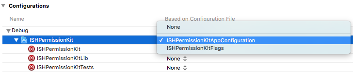
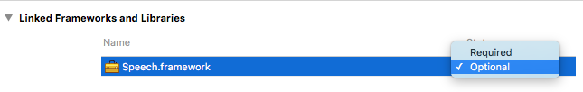

#  ISHPermissionKit

[](http://travis-ci.org/iosphere/ISHPermissionKit)&nbsp;
[](http://cocoadocs.org/docsets/ISHPermissionKit)&nbsp;
[](https://github.com/Carthage/Carthage)

*ISHPermissionKit* provides a polite and unified way of asking for permission on iOS. It
also provides UI to explain the permission requirements before presenting
the system permission dialog to the user. This allows the developer to postpone
the system dialog. The framework provides no actual chrome, leaving the
developer and designer in charge of creating the views.

While you can use *ISHPermissionKit* to ask for a user's permission for multiple
categories at the same time and out of context, you should continue to ask for
permission only when the app needs it. However, there might be occassions when
multiple permissions are required at the same time, e.g., when starting to record
location and motion data.

This framework also provides explicit ways to ask for the user's permission
where the system APIs only provide implicit methods of doing so.

**Supported permission categories:**

* Calendar: Events and Reminders
* Contacts
* Location: Always and WhenInUse
* Motion: Activity data (step counting, etc.)
* HealthKit
* Microphone
* Music Library
* Notifications: Local and Remote
* Photos: Library and Camera
* Social: Facebook, Twitter, SinaWeibo, TencentWeibo
* Siri
* Speech Recognition

The library compiles with the **iOS 9.3 SDK** and later and deploys back to
**iOS 7**. Permission categories that were added later than the deployment 
target will be skipped on unsupported versions.

All permission categories relate to **sensitive user information**. If your app
binary contains code to access this information, it has to comply with
special review guidelines and other requirements to pass binary validation
in iTunes Connect and app review. Therefore, you must specifically enable
the categories you need with build flags, everything else will not be included
in the framework. Please read the [installation instructions](#installation)
carefully.

*ISHPermissionKit* verifies that the required usage descriptions are provided in your
app's `Info.plist`. If the `DEBUG` preprocessor macro is set, it will assert and
explain which keys need to be added. Other requirements for each permission
category are mentioned in the header documentation in `ISHPermissionCategory.h`.

 

In contrast to other libraries, *ISHPermissionKit* allows you to present custom 
view controllers, ask for several permissions in a sequence, provides a unified
API through subclasses, and is **iOS 10 compatible**.

Recommended reading: [The Right Way to Ask Users for Mobile
Permissions](https://medium.com/@mulligan/the-right-way-to-ask-users-for-ios-permissions-96fa4eb54f2c "by Brenden Mulligan (@mulligan)")

# Roadmap

Missing features:

1. Resetting state correctly when device is reset
2. Permission monitoring and NSNotifications upon changes

Please file an issue for missing permissions.

# How to Use

## Sample App

In order to demonstrate all steps that are required to use *ISHPermissionKit*,
the sample application has a [separate repository](https://github.com/iosphere/ISHPermissionKitSampleApp).

The sample app uses the [dynamically-linked framework](#dynamically-linked-framework).

## Installation

### Build Flags

Your variant of *ISHPermissionKit* will only include the permission categories
you actually need. We use preprocessor macros to ensure any unused code is not
compiled to save you from suprising App Store rejections, as some privacy 
guidelines apply to all apps that *contain* code to access user data, regardless 
of whether or not the code is ever called in your app. How to enable the
categories you need depends on how you install *ISHPermissionKit* (see below).

### Static Library

Add this Xcode project as a subproject of your app. Then link your app target 
against the static library (`ISHPermissionKitLib.a`). You will also need to add
the static library as a target dependency. Both settings can be found in your 
app target's *Build Phases*.

**You must [provide a build configuration](#providing-a-build-configuration) manually.**

Use `#import <ISHPermissionKit/ISHPermissionKit.h>` to import all public headers.
The static library version is recommended when you need to support iOS 7 or
if you are concerned about app launch time, as a high number of dynamic libraries
could increase the latter.

### Dynamically-Linked Framework

Add this Xcode project as a subproject of your app. Then add the framework
(`ISHPermissionKit.framework`) to the app's embedded binaries (on the *General*
tab of your app target's settings). On the *Build Phases* tab, verify that the
framework has also been added to the *Target Dependencies* and *Link Binary with
Libraries* phases, and that a new *Embed Frameworks* phase has been created.

**You must [provide a build configuration](#providing-a-build-configuration) manually.**

You can use [Carthage](https://github.com/Carthage/Carthage) to fetch and build
the framework. You will still have to provide a build configuration manually.

The framework can be used as a module, so you can use `@import ISHPermissionKit;`
to import all public headers.  
Further reading on Modules: [Clang Documentation](http://clang.llvm.org/docs/Modules.html)

**Note:** To link against dynamic frameworks on iOS, a deployment target of at
least iOS 8 is required. If you use Swift, you must use dynamic frameworks.

### Providing a Build Configuration

When building the static or dynamic library, *ISHPermissionKit* will look for a
file named `ISHPermissionKitAppConfiguration.xcconfig` in the same directory as
*ISHPermissionKit*'s root directory (not *within* the root directory), and two
levels further up the directory hierarchy. Configuration files in either
location allow you to set preprocessor flags that will be used when compiling
the framework.

We strongly recommend to start with a copy of the template config provided in this
repository, [`ISHPermissionKitAppConfiguration.xcconfig`](/ISHPermissionKitAppConfiguration.xcconfig).
It includes a list of all supported flags, and you can easily specify which features
you need by commenting or uncommenting the respective lines.

You will have to use the same configuration file to build your app, else the
category-specific symbols will not be available. In your project settings, you
can select a configuration file for each target:



If you already use a configuration file, you can pick one and include the other
in it. Ensure to always use `$(inherit)` when setting preprocessor macros.

### Required Frameworks

*ISHPermissionKit* uses system frameworks to accomplish its tasks. Most of
them will be linked automatically unless you have disabled "Enable Modules"
(`CLANG_ENABLE_MODULES`) and "Link Frameworks Automatically" 
(`CLANG_MODULES_AUTOLINK`) in your app target's build settings.

Unfortunately, some framework are not weakly linked automatically which
will cause your app to crash at launch on older systems that don't support
the respective framework. These frameworks must be explicitly linked in
your app, and set to "Optional". Feel free to duplicate rdar://28008958
(https://openradar.appspot.com/search?query=28008958).



This is currently required for the *Speech* framework, and only if you
enable the speech permission category.

### Cocoa Pods

You can use CocoaPods to install *ISHPermissionKit* as a static or dynamic library.
Each permission category requires a separate (sub)pod. The following sample Podfile
includes all available pods – you should pick only those that you are actually
using in your app.

```ruby
target 'MyApp' do
  use_frameworks! // remove this line if you want to link your pods statically
  pod 'ISHPermissionKit/Motion'
  pod 'ISHPermissionKit/Health'
  pod 'ISHPermissionKit/Location'
  pod 'ISHPermissionKit/Microphone'
  pod 'ISHPermissionKit/PhotoLibrary'
  pod 'ISHPermissionKit/Camera'
  pod 'ISHPermissionKit/Notifications'
  pod 'ISHPermissionKit/SocialAccounts'
  pod 'ISHPermissionKit/Contacts'
  pod 'ISHPermissionKit/Calendar'
  pod 'ISHPermissionKit/Reminders'
  pod 'ISHPermissionKit/Siri'
  pod 'ISHPermissionKit/Speech'
  pod 'ISHPermissionKit/MusicLibrary'
end
```

[Providing a build configuration](#providing-a-build-configuration) manually is not
required when you use CocoaPods, and you can also ignore the
[Required Frameworks](#required-frameworks) section.

See the [official website](https://cocoapods.org/#get_started) to get started with
CocoaPods.

## ISHPermissionsViewController

You can request permission for a single category or a sequence of categories.
The following example presents a `ISHPermissionsViewController` for `Activity`
and `LocationWhenInUse` permissions if needed.

```objective-c  
NSArray *permissions = @[ 
    @(ISHPermissionCategoryLocationWhenInUse), 
    @(ISHPermissionCategoryActivity) 
    ];
ISHPermissionsViewController *vc = [ISHPermissionsViewController permissionsViewControllerWithCategories:permissions dataSource:self];

if (vc) {
    UIViewController *presentingVC = [self.window rootViewController];
    [presentingVC presentViewController:vc
                               animated:YES
                             completion:nil];
} 
```  

The designated constructor returns `nil` if non of the categories allow a user
prompt (either because the user already granted or denied the permission, does
not want to be asked again, or the feature is simply not supported on the
device).

You can set a `completionBlock` or `delegate` (both optional) that will be
notified once the `ISHPermissionsViewController` has iterated through all
categories. If you do not set a delegate, the view controller will simply be
dismissed once finished, and if set, the completion block will be called. If you
do set a delegate, the delegate is responsible for dismissing the view
controller.

The `dataSource` is required and must provide one instance of a
`ISHPermissionRequestViewController` for each requested 
`ISHPermissionCategory`.

The `ISHPermissionRequestViewController` provides `IBAction`s to _prompt for the
user's permission_, _ask later_, and _don't ask_. It does not however provide
any buttons or UI. Your subclass can create a view with text, images, and buttons
etc., explaining in greater detail why your app needs a certain permission. The
subclass should contain buttons that trigger at least one of the actions
mentioned above (see the header for their signatures). A _cancel button_ should
call `changePermissionStateToAskAgainFromSender:`. If your subclass overwrites 
any of these three actions, you must call `super`.

## ISHPermissionRequest

The `ISHPermissionRequest` can be used to determine the current state of a
permission category. It can also be used to trigger the user prompt asking for
permissions outside of the `ISHPermissionsViewController`.

You must use the additional (`...+All.h`) method `+requestForCategory:` to create the
appropriate request for the given permission category.

Here is how you check the permissions to access the microphone:

```objective-c  
ISHPermissionRequest *r = [ISHPermissionRequest requestForCategory:ISHPermissionCategoryMicrophone];
BOOL granted = ([r permissionState] == ISHPermissionStateAuthorized);
```

The same example for local notifications (`granted` will always be true on iOS 7): 

```objective-c  
ISHPermissionRequest *r = [ISHPermissionRequest requestForCategory:ISHPermissionCategoryNotificationLocal];
BOOL granted = ([r permissionState] == ISHPermissionStateAuthorized);
```

# How to Contribute

Contributions are welcome. Check out the roadmap and open issues. 
Adding support for more permission types is probably 
most rewarding, you can find a few hints on how to get started below.

## Adding Support for New Permissions

You will need to create a new subclass of `ISHPermissionRequest` and add an
`ISHPermissionCategory` (make sure to use explicit values as these may be
persisted). Don't change existing values. Finally, wire it up in
`ISHPermissionRequest+All` by returning your new subclass in
`+requestForCategory:`.

Subclasses must implement at least two methods:

1. `- (ISHPermissionState)permissionState`
2. `- (void)requestUserPermissionWithCompletionBlock:(ISHPermissionRequestCompletionBlock)completion`

What these methods actually do depends on the mechanism that the system APIs
provide. Ideally, `permissionState` should check the system authorization state
first and return appropriate internal enum values from
`ISHPermissionState`. If the system state is unavailable or is similar to
`kCLAuthorizationStatusNotDetermined` then this method should return
`internalPermissionState`. You should try to map system provided states to
`ISHPermissionState` without resorting to the `internalPermissionState` as much as
possible.

When requesting the permission state you should only store the result in
`internalPermissionState` if the state cannot easily be retrieved from the
system (as is the case, e.g., with activity monitoring from the designated
co-processor).

Before a new permission can be added, you must introduce a new build flag and
ensure the library compiles with and without it. Please update this document
accordingly, add the new build flag to the template configuration file
([`ISHPermissionKitAppConfiguration.xcconfig`](/ISHPermissionKitAppConfiguration.xcconfig)),
and create a new CocoaPods subspec.

# Attribution

*ISHPermissionKit* icon designed by 
[Jason Grube (CC BY 3.0)](http://thenounproject.com/term/fingerprint/23303/) from the 
[Noun Project](http://thenounproject.com)

# More OpenSource Projects by iosphere

 [`ISHHoverBar`](https://github.com/iosphere/ISHHoverBar) - A floating UIToolBar replacement as seen in the iOS 10 Maps app, supporting both vertical and horizontal orientation

 [`ISHPullUp`](https://github.com/iosphere/ISHPullUp) - Vertical split view controller with pull up gesture as seen in the iOS 10 Maps app

# Apps Using ISHPermissionKit

 
<a href="http://trails.io/" title="Trails · Outdoor GPS Logbook">Trails · Outdoor GPS Logbook</a>

 
<a href="http://rudel.io/" title="Rudel · Anonymous Location Sharing">Rudel · Anonymous Location Sharing</a>

 
<a href="https://itunes.apple.com/app/sumup/id514879214" title="SumUp – Accept EMV card payments">SumUp – Accept EMV card payments</a>

 
<a href="https://itunes.apple.com/en/app/snow-report-myswitzerland/id341755817?mt=8" title="Swiss Snow Report - Current snow and weather information for the best Swiss winter sports destinations">Swiss Snow Report</a>

If your app uses ISHPermissionKit, let us know and we will include it here.
